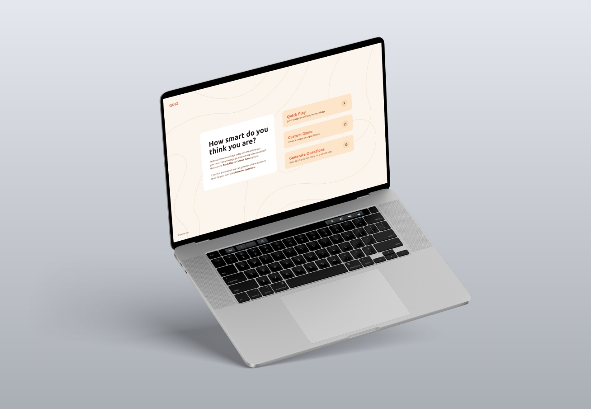
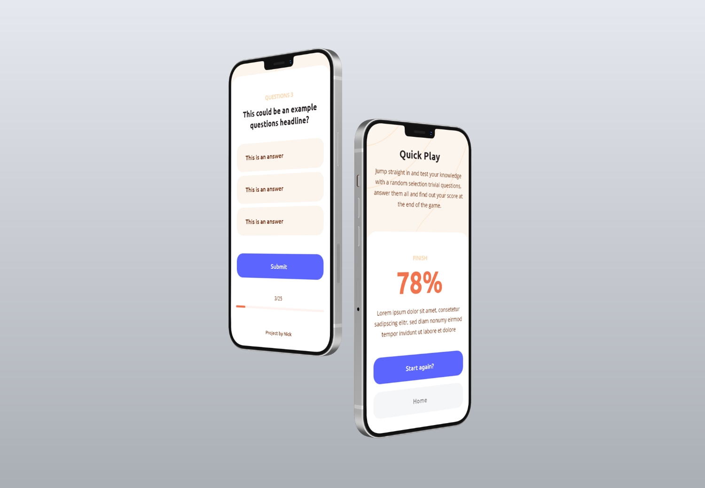

# Quiz Website Application

During the first lockdown of 2020, hosting a quiz over zoom was the next big thing to do. I wanted to create a simple web application that could generate a quiz quickly. Using the Open Trivia Database for the data and jQuery to build everything on the frontend.

Future features for the project is to add the ability to generate a custom quiz based on certain parameters and also create a scoreboard that will allow players to track their score when they’re playing a game.





---

## Getting Started

The applcaition is a simple front-end website so it doesn't require much to get it up and running.

### Prerequisites

* Modern web browser
* Internet connection

### Installing

Here's how to get it running.

Clone the git repo

```
git glone https://github.com/enarsinick/Trivia-Application.git
```

Then just simply open the index.html file in a web browser.

---

## Future Updates
- Ability to create a custom game by selecting a category, difficulty and number of questions
- Ability to generate a list of questions in order to do your own quiz
- Page transitions and element animations
- Button hover styles etc

---

## Known Bugs
- The question and button text characters are sometimes formatted weirdly, specifically when using special characters.

---

## Built With

* [Open Trivia Database](https://opentdb.com/api_config.php) - Third-party API
* [jQuery](https://jquery.com/)
* [SASS](https://sass-lang.com/)


